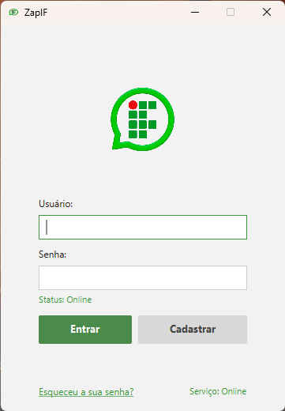
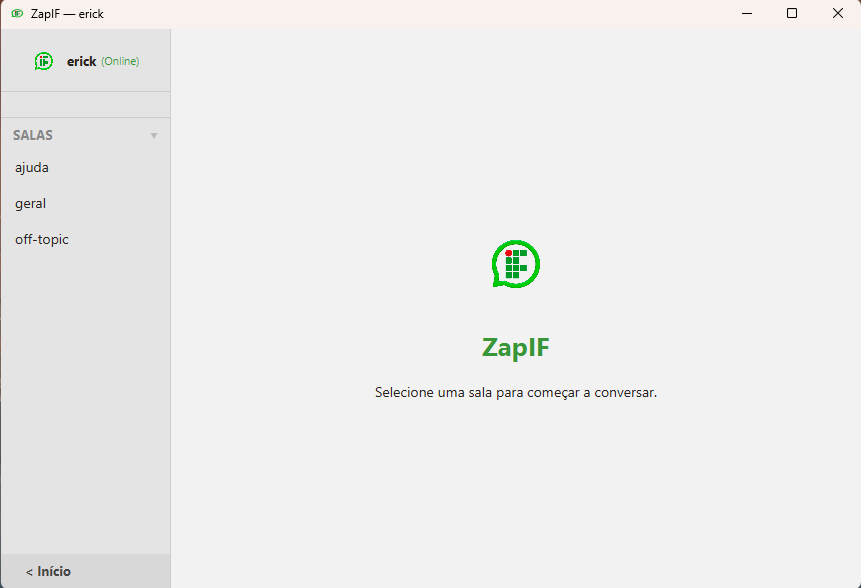
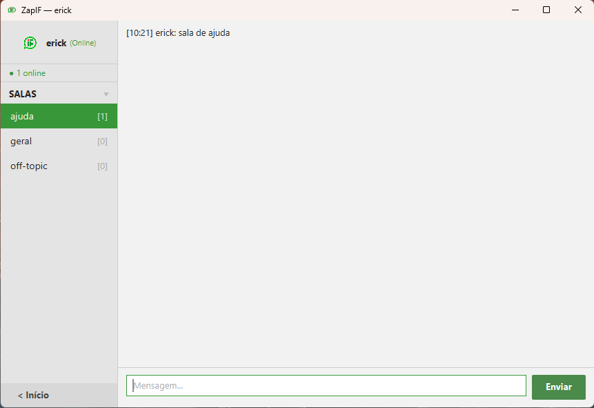

# ZapIF — Chat em Tempo Real com JavaFX + Socket

> Projeto desenvolvido para a disciplina de **Linguagem de Programação 1**.
> O objetivo é explorar na prática o funcionamento de **threads**, **conexões via socket TCP** e **interfaces gráficas com JavaFX**, integrando esses conceitos em uma aplicação completa de chat cliente-servidor.

Sistema de chat cliente-servidor via TCP. O servidor roda como processo único e os clientes conectam via JavaFX desktop.

```
Cliente A ──── TCP ───► Servidor (porta 5000) ◄──── TCP ──── Cliente B
```

---

## Screenshots

| Login | Home | Sala de Chat |
|:---:|:---:|:---:|
|  |  |  |

---

## Estrutura

```
chat-app/
├── server/          # Servidor (Java puro + SQLite)
│   └── src/main/java/server/
│       ├── Server.java          # entry point — ServerSocket + thread pool
│       ├── ClientHandler.java   # uma thread por cliente, interpreta o protocolo
│       ├── Room.java            # agrupa clientes, faz broadcast
│       └── Database.java        # SQLite: usuários, salas, mensagens
│
└── client/          # Cliente (JavaFX 21)
    └── src/main/
        ├── java/client/
        │   ├── Main.java                    # entry point JavaFX
        │   ├── network/Connection.java       # socket + retry automático
        │   ├── ui/LoginController.java       # tela de login/cadastro
        │   ├── ui/ChatController.java        # tela principal de chat
        │   └── model/{User,Message}.java
        └── resources/client/ui/
            ├── login.fxml
            └── chat.fxml
```

---

## Pré-requisitos

| Ferramenta | Versão mínima | Como verificar |
|---|---|---|
| JDK | 17 | `java -version` |
| Maven | 3.8 | `mvn -version` |

> **Windows**: certifique-se de que `JAVA_HOME` aponta para o JDK 17+ e que `%JAVA_HOME%\bin` está no `PATH`.

---

## Como rodar

### Passo 1 — Compilar e iniciar o servidor

Abra um terminal na raiz do projeto:

```bash
cd chat-app/server
mvn package -q
java -jar target/chat-server-1.0-SNAPSHOT.jar
```

Saída esperada:
```
Banco de dados pronto.
Servidor iniciado na porta 5000 (max 100 clientes)
```

O arquivo `chat.db` é criado automaticamente no diretório atual (SQLite). Mantenha esse terminal aberto — o servidor precisa continuar rodando.

### Passo 2 — Iniciar o cliente

Abra **outro** terminal:

```bash
cd chat-app/client
mvn javafx:run
```

A janela de login abre. Clique em **Cadastrar** para criar uma conta, depois **Entrar**.

> Para abrir múltiplos clientes (simular conversa), repita o `mvn javafx:run` em terminais adicionais.

### Conectar dois computadores na mesma rede

1. Descubra o IP local do computador que roda o servidor:
   - Windows: `ipconfig` → "Endereço IPv4"
   - Linux/Mac: `ip a` ou `ifconfig`
2. Edite `client/src/main/java/client/network/Connection.java`, linha:
   ```java
   private static final String HOST = "localhost"; // ← troque pelo IP
   ```
3. Recompile e rode o cliente nos outros computadores.

---

## Problemas comuns

| Sintoma | Causa provável | Solução |
|---|---|---|
| `Could not find or load main class` | Maven não compilou | Rode `mvn package` antes do `java -jar` |
| `Connection refused` no cliente | Servidor não está rodando | Inicie o servidor primeiro (Passo 1) |
| Porta 5000 já em uso | Outro processo na porta | `netstat -ano \| findstr :5000` (Windows) e encerre o processo |
| `UnsatisfiedLinkError` JavaFX | JRE sem JavaFX | Use JDK 17+ e rode via `mvn javafx:run`, não `java -jar` |
| Login trava por 10 s | Servidor não responde | Verifique se o servidor está no ar e acessível |

---

## Protocolo de mensagens

Texto puro separado por `|`. O servidor recusa campos com `|` para evitar quebra do protocolo.

| Mensagem | Direção | Descrição |
|---|---|---|
| `REGISTER\|nome\|senha` | cliente → servidor | Cadastrar usuário |
| `LOGIN\|nome\|senha` | cliente → servidor | Autenticar |
| `JOIN\|sala` | cliente → servidor | Entrar em sala |
| `MSG\|sala\|nome\|texto` | ambos | Enviar/receber mensagem |
| `ROOMS\|sala1,sala2,...` | servidor → cliente | Lista de salas após login |
| `HISTORY\|sala\|msg1\|msg2\|...` | servidor → cliente | Histórico ao entrar na sala |
| `OK\|contexto` | servidor → cliente | Confirmação (REGISTER, LOGIN) |
| `ERROR\|motivo` | servidor → cliente | Erro descritivo |

### Limites validados

| Campo | Limite |
|---|---|
| Nome de usuário | 3–24 caracteres, sem `\|` |
| Senha | 6–64 caracteres |
| Texto de mensagem | 1–500 caracteres, `\|` removido |
| Nome de sala | sem `\|` |

---

## Banco de dados (SQLite)

Tabelas criadas automaticamente na primeira execução:

```sql
usuarios  (id, nome UNIQUE, senha_hash, salt)
salas     (id, nome UNIQUE)
mensagens (id, sala_nome, usuario, texto, timestamp)
```

Senha armazenada com **PBKDF2-HMAC-SHA256** + salt aleatório por usuário (100 000 iterações).

---

## Arquitetura do cliente

```
Thread JavaFX (UI)              Thread "chat-connect" (daemon)
├── LoginController             ├── Socket.connect()
├── ChatController              ├── readLine() loop
└── reage a Platform.runLater() └── Platform.runLater() → notifica listeners
```

### Estados de conexão

```
CONNECTING → CONNECTED → (queda) → DISCONNECTED → retry 5s → CONNECTING ...
```

O banner vermelho "Sem conexão" aparece em `DISCONNECTED` e some ao reconectar.

---

## Empacotamento para distribuição

### Servidor (fat-jar)

```bash
cd server && mvn package
# gera: target/chat-server-1.0-SNAPSHOT.jar
java -jar target/chat-server-1.0-SNAPSHOT.jar
```

### Cliente (instalador nativo)

```bash
cd client && mvn javafx:jlink   # gera runtime image
# ou
jpackage --input target/ --main-jar chat-client.jar --main-class client.Main \
         --type exe --name ChatApp   # Windows
```

---

## Salas padrão

Criadas automaticamente se não existirem:

- `geral`
- `off-topic`
- `ajuda`

---

## Decisões de design

| Decisão | Justificativa |
|---|---|
| Thread-per-client no servidor | simples, sem framework externo |
| ExecutorService (pool 100) | evita criação ilimitada de threads sob carga |
| CopyOnWriteArrayList nos clientes da sala | leitura frequente, escrita rara |
| PBKDF2 + salt no hash | resistência a rainbow tables sem dependência extra |
| Platform.runLater() centralizado em Connection | controllers não precisam conhecer threading |
| Split com limite no parser (`split("\\|", 4)`) | campo de texto pode conter `\|` sem quebrar |
