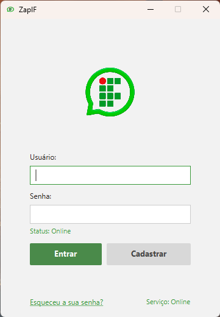
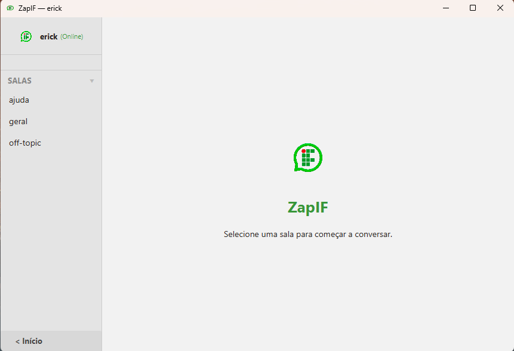
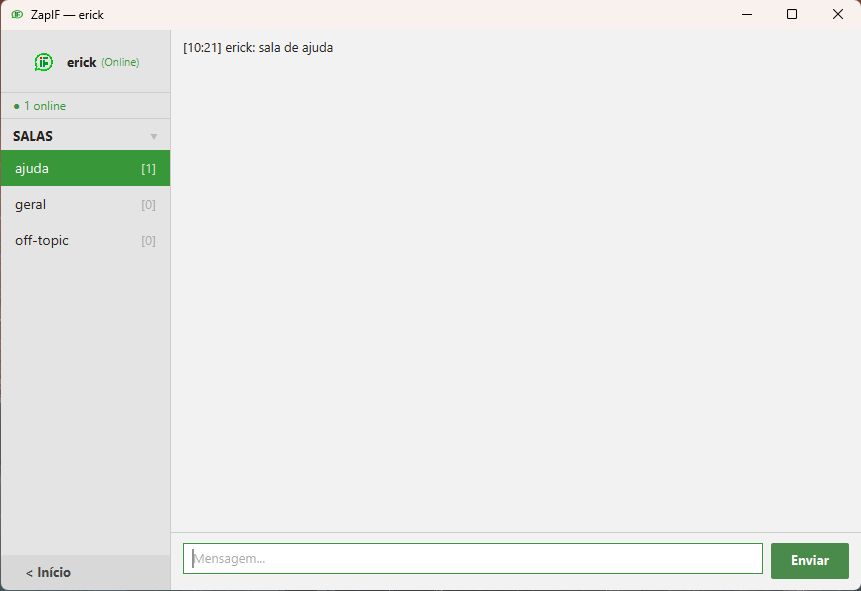

# ZapIF — Chat em Tempo Real com JavaFX + Socket

> Projeto desenvolvido para a disciplina de **Linguagem de Programação 1**.
> O objetivo é explorar na prática o funcionamento de **threads**, **conexões via socket TCP** e **interfaces gráficas com JavaFX**, integrando esses conceitos em uma aplicação completa de chat cliente-servidor.

Sistema de chat cliente-servidor via TCP. O servidor roda como processo único e os clientes conectam via JavaFX desktop.

```
Cliente A ──── TCP ───► Servidor (porta 5001) ◄──── TCP ──── Cliente B
```

---

## Screenshots

| Login | Home | Sala de Chat |
|:---:|:---:|:---:|
|  |  |  |

---

## Estrutura

```
ZapIF/
├── pom.xml          # pom agregador (módulos server e client)
├── mvnw, mvnw.cmd   # Maven Wrapper — não precisa ter o Maven instalado
├── .mvn/wrapper/
│
├── server/          # Servidor (Java puro + SQLite)
│   ├── pom.xml
│   └── src/main/java/server/
│       ├── Servidor.java            # entry point — ServerSocket + thread pool
│       ├── ManipuladorCliente.java  # uma thread por cliente, interpreta o protocolo
│       ├── RegistroSessao.java      # usuários online (impede login duplicado)
│       ├── Sala.java                # agrupa clientes, faz broadcast
│       └── BancoDados.java          # SQLite: usuários, salas, mensagens
│
├── client/          # Cliente (JavaFX 21)
│   ├── pom.xml
│   └── src/main/
│       ├── java/
│       │   ├── module-info.java
│       │   └── client/
│       │       ├── Main.java                          # entry point JavaFX
│       │       ├── network/Conexao.java               # socket + retry automático
│       │       ├── network/OuvinteMensagem.java       # listener de mensagens
│       │       ├── network/OuvinteStatusConexao.java  # listener de status da conexão
│       │       ├── ui/ControladorLogin.java           # tela de login/cadastro
│       │       ├── ui/ControladorChat.java            # tela principal de chat
│       │       └── model/{Usuario,Mensagem}.java
│       └── resources/client/
│           ├── icon.png
│           └── ui/
│               ├── login.fxml
│               ├── chat.fxml
│               └── style.css
│
├── docs/screenshots/  # imagens deste README
└── uml/               # diagramas (Astah + PlantUML) e escopo
```

---

## Pré-requisitos

| Ferramenta | Versão mínima | Como verificar |
|---|---|---|
| JDK | 17 | `java -version` |
| Maven | 3.8 (opcional) | `mvn -version` |

O projeto inclui o **Maven Wrapper** (`./mvnw` no Linux/Mac, `mvnw.cmd` no Windows), que baixa o Maven 3.9.6 na primeira execução. Se preferir usar um Maven instalado, troque `./mvnw` por `mvn` nos comandos abaixo. Todos os comandos são executados **na raiz do repositório**.

> **Windows**: certifique-se de que `JAVA_HOME` aponta para o JDK 17+ e que `%JAVA_HOME%\bin` está no `PATH`. Use `mvnw.cmd` no lugar de `./mvnw`.

---

## Como rodar

### Passo 1 — Compilar e iniciar o servidor

Abra um terminal na raiz do projeto:

```bash
./mvnw package          # compila server e client
java -jar server/target/zapif-server-1.0-SNAPSHOT.jar
```

Saída esperada:
```
Banco de dados pronto.
Servidor iniciado na porta 5001 (max 100 clientes)
```

> Antes dessas linhas podem aparecer três avisos `SLF4J: ...` emitidos pelo driver do SQLite — são inofensivos.

O arquivo `chat.db` é criado automaticamente no diretório atual (SQLite). Mantenha esse terminal aberto — o servidor precisa continuar rodando. Para encerrar, `Ctrl+C`.

### Passo 2 — Iniciar o cliente

Abra **outro** terminal, também na raiz do projeto:

```bash
./mvnw -pl client javafx:run
```

A janela de login abre. Clique em **Cadastrar** para criar uma conta, depois **Entrar**.

> Para abrir múltiplos clientes (simular conversa), repita o `./mvnw -pl client javafx:run` em terminais adicionais.

### Conectar dois computadores na mesma rede

Por padrão o cliente conecta em `localhost:5001`. Para apontar para outro computador **não é preciso recompilar**:

1. Descubra o IP local do computador que roda o servidor:
   - Windows: `ipconfig` → "Endereço IPv4"
   - Linux/Mac: `ip a` ou `ifconfig`
2. Nos outros computadores, inicie o cliente informando o IP:
   ```bash
   ./mvnw -pl client javafx:run -Dzapif.host=192.168.0.10
   ```
   Ou use variáveis de ambiente:
   ```bash
   ZAPIF_HOST=192.168.0.10 ./mvnw -pl client javafx:run       # Linux/Mac
   ```
   ```powershell
   $env:ZAPIF_HOST="192.168.0.10"; .\mvnw.cmd -pl client javafx:run   # Windows (PowerShell)
   ```
3. Libere a porta 5001 (TCP) no firewall do computador do servidor.

| Configuração | Propriedade (`-D`) | Variável de ambiente | Padrão |
|---|---|---|---|
| Host do servidor | `zapif.host` | `ZAPIF_HOST` | `localhost` |
| Porta do servidor | `zapif.port` | `ZAPIF_PORT` | `5001` |

A propriedade `-D` tem prioridade sobre a variável de ambiente. Fora do Maven (ex.: imagem gerada pelo `jlink`), passe a propriedade direto para a JVM: `client/target/image/bin/java -Dzapif.host=192.168.0.10 -m client/client.Main`.

> A porta do **servidor** é fixa em `Servidor.PORTA` (5001); `zapif.port` só muda para onde o cliente conecta.

---

## Problemas comuns

| Sintoma | Causa provável | Solução |
|---|---|---|
| `Unable to access jarfile server/target/...` | Maven não compilou | Rode `./mvnw package` antes do `java -jar` |
| Banner "Sem conexão — reconectando..." / "Serviço: sem conexão" | Servidor não está rodando ou host errado | Inicie o servidor primeiro (Passo 1) e confira `zapif.host` |
| `Erro fatal no servidor: Address already in use` | Outro processo na porta 5001 | `netstat -ano \| findstr :5001` (Windows) ou `lsof -i :5001` (Linux/Mac) e encerre o processo |
| `UnsatisfiedLinkError` / `JavaFX runtime components are missing` | JRE sem JavaFX | Use JDK 17+ e rode via `./mvnw -pl client javafx:run`, não `java -jar` |
| Login trava por 10 s | Servidor não responde | Verifique se o servidor está no ar e acessível |
| `Usuário já está conectado em outra sessão` | Mesmo usuário logado em outro cliente | Feche a outra sessão ou use outro usuário |

---

## Protocolo de mensagens

Texto puro, uma mensagem por linha, campos separados por `|`. Linhas com mais de 4096 caracteres são recusadas. Nomes de usuário com `|` são recusados; em nomes de sala e textos de mensagem o `|` é removido.

| Mensagem | Direção | Descrição |
|---|---|---|
| `REGISTER\|nome\|senha` | cliente → servidor | Cadastrar usuário |
| `LOGIN\|nome\|senha` | cliente → servidor | Autenticar |
| `JOIN\|sala` | cliente → servidor | Entrar em sala (sai da anterior, se houver) |
| `LEAVE\|sala` | cliente → servidor | Sair da sala atual (volta para a tela inicial) |
| `MSG\|sala\|nome\|texto` | ambos | Enviar/receber mensagem — o servidor usa o nome do usuário autenticado, não o enviado |
| `PONG` | cliente → servidor | Resposta ao `PING` |
| `ROOMS\|sala1,sala2,...` | servidor → cliente | Lista de salas após login |
| `ONLINE\|total\|sala1:n,sala2:n,...` | servidor → cliente | Usuários online e contagem por sala (após login e a cada entrada/saída) |
| `HISTORY\|sala\|msg1\|msg2\|...` | servidor → cliente | Últimas 50 mensagens ao entrar na sala (`[HH:mm] nome: texto`, com separadores de data) |
| `PING` | servidor → cliente | Heartbeat a cada 20 s após o login |
| `OK\|contexto` | servidor → cliente | Confirmação (`OK\|REGISTER`, `OK\|LOGIN`) |
| `ERROR\|motivo` | servidor → cliente | Erro descritivo |

Avisos de entrada/saída (`[nome entrou]`, `[nome saiu]`, `[nome desconectou]`) são enviados como linhas de texto livres para os demais membros da sala.

O servidor encerra a conexão se não receber nada por 45 s (o cliente responde `PING` com `PONG` automaticamente).

### Limites validados

| Campo | Limite |
|---|---|
| Nome de usuário | 3–24 caracteres, sem `\|` |
| Senha | 6–64 caracteres |
| Texto de mensagem | 1–500 caracteres (excedente é cortado), `\|` removido |
| Nome de sala | até 64 caracteres, `\|` removido; precisa existir no banco |

---

## Banco de dados (SQLite)

Tabelas criadas automaticamente na primeira execução:

```sql
usuarios  (id, nome UNIQUE, senha_hash, salt)
salas     (id, nome UNIQUE)
mensagens (id, sala_nome, usuario, texto, timestamp)
```

Senha armazenada com **PBKDF2-HMAC-SHA256** + salt aleatório por usuário (100 000 iterações).

---

## Arquitetura do cliente

```
Thread JavaFX (UI)              Thread "chat-connect" (daemon)
├── ControladorLogin            ├── Socket.connect()
├── ControladorChat             ├── readLine() loop
└── reage a Platform.runLater() └── Platform.runLater() → notifica listeners
```

### Estados de conexão

```
CONECTANDO → CONECTADO → (queda) → DESCONECTADO → retry 5s → CONECTANDO ...
```

O banner vermelho "Sem conexão — reconectando..." aparece em `DESCONECTADO` e some ao reconectar.

---

## Empacotamento para distribuição

### Servidor (fat-jar)

```bash
./mvnw -pl server package
# gera: server/target/zapif-server-1.0-SNAPSHOT.jar (com o driver SQLite embutido)
java -jar server/target/zapif-server-1.0-SNAPSHOT.jar
```

### Cliente (instalador nativo)

```bash
./mvnw -pl client package javafx:jlink   # gera runtime image em client/target/image
client/target/image/bin/java -m client/client.Main   # testa a imagem

# instalador (rode no SO de destino; --type: exe/msi no Windows, dmg/pkg no Mac, deb/rpm no Linux)
jpackage --runtime-image client/target/image --module client/client.Main \
         --name ZapIF --dest client/target/dist --type exe
```

---

## Salas padrão

Criadas automaticamente se não existirem:

- `geral`
- `off-topic`
- `ajuda`

---

## Decisões de design

| Decisão | Justificativa |
|---|---|
| Thread-per-client no servidor | simples, sem framework externo |
| ExecutorService (pool 100) | evita criação ilimitada de threads sob carga |
| CopyOnWriteArrayList nos clientes da sala | leitura frequente, escrita rara |
| PBKDF2 + salt no hash | resistência a rainbow tables sem dependência extra |
| Platform.runLater() centralizado em Conexao | controllers não precisam conhecer threading |
| Split com limite no parser (`split("\\|", 4)`) | campo de texto pode conter `\|` sem quebrar |
